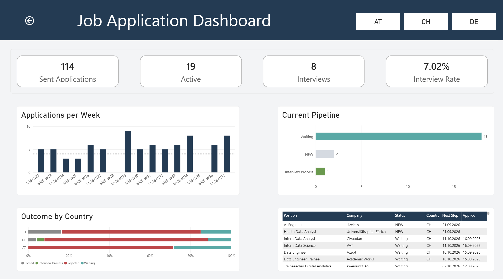
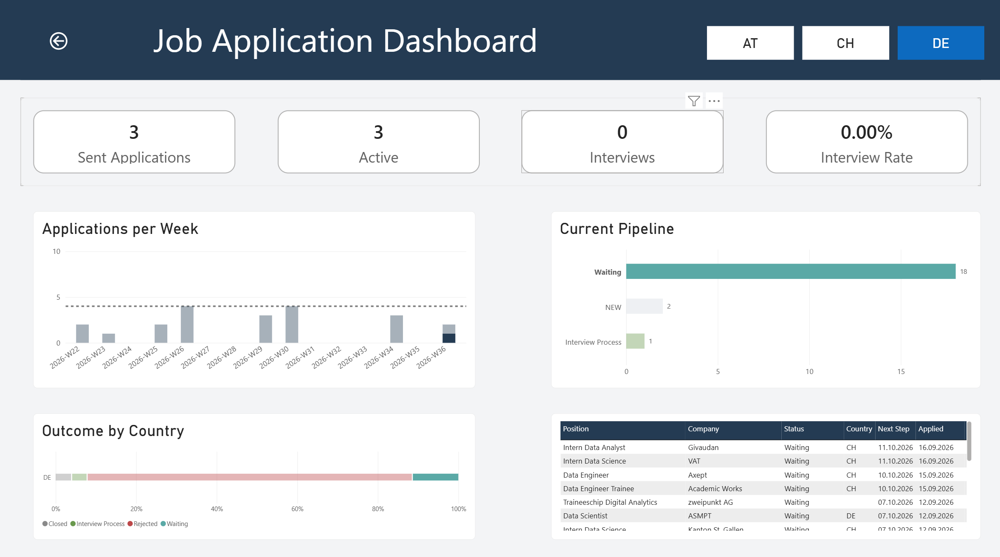
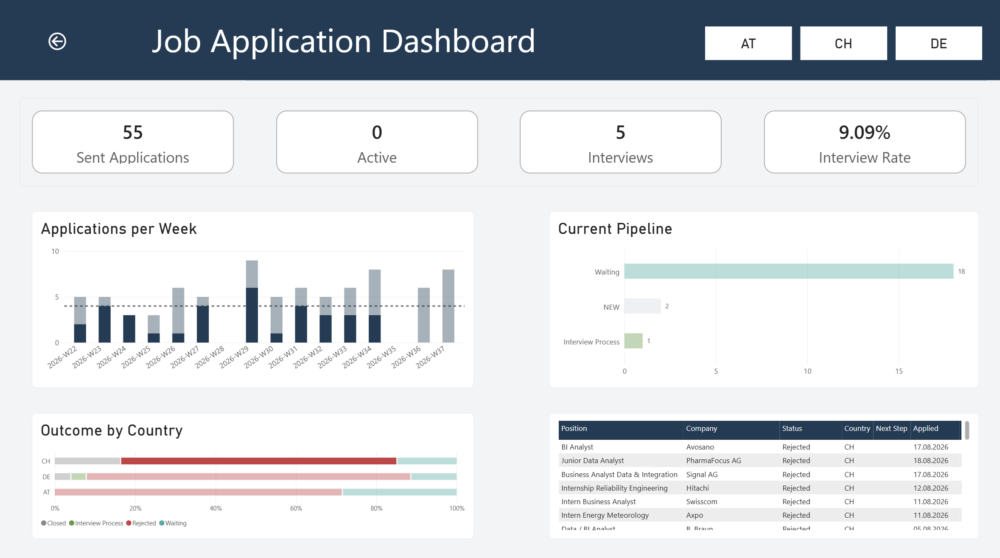

# Job Application Data Pipeline

## Overview
Deliberately overengineered ETL architecture for small personal dataset to practice data ingestion, PostgresSQL transformations, data quality checks and Power BI reporting.

## Pipeline

1. Manual entries into Excel
2. Python script to process raw data into database, validate source structure
3. Clean and standardize in staging
4. Add simple analytics logicin mart
5. Refresh Power BI dashboard

## Dashboard

KPIs:
- Applications sent
- Active applications
- Interviews & Interview rate

Visuals:
- Applications per week
- Current Pipeline
- Outcomes per country
- Active applications table
